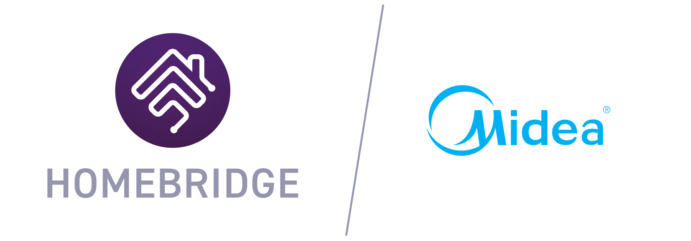

<p align="center">
  <a href="https://github.com/homebridge/verified/blob/master/verified-plugins.json"></a>
</p>

# homebridge-midea-platform

[](https://github.com/homebridge/homebridge/wiki/Verified-Plugins)
[](https://www.npmjs.com/package/homebridge-midea-platform)
[](https://www.npmjs.com/package/homebridge-midea-platform)

*Verified* plugin for Midea devices. This is implemented by building on the Homebridge platform plugin template and the work done by [@georgezhao2010](https://github.com/georgezhao2010) in the [midea_ac_lan](https://github.com/georgezhao2010/midea_ac_lan) project for Home Assistant. Also thanks to the work done by [@mill1000](https://github.com/mill1000) in the [midea-msmart (msmart-ng)](https://github.com/mill1000/midea-msmart) project.

Pull requests and/or other offers of development assistance gratefully received.

More information can be found in the [wiki](https://github.com/kovapatrik/homebridge-midea-platform/wiki).

## IMPORTANT NOTICE
- As written by [@wuwentao](https://github.com/wuwentao) in the [midea_ac_lan repository](https://github.com/wuwentao/midea_ac_lan), Midea disabled the token fetching APIs in both Meiju and Midea SmartHome, and now it's only available using the NetHome Plus API.
- It's expected that the token fetching in NetHome Plus API will be disabled as well.
- Make sure you save your devices' token and key to be able to usem them in the future.
- [@wuwentao](https://github.com/wuwentao) also wrote a nice summary about the history of what happened: https://github.com/mill1000/midea-msmart/issues/201#issuecomment-2746782457
- For these reasons, only NetHome Plus is enabled in the discovery process.

## Features

Currently supports the following devices:

| Device | ID | Docs |
|--------|----|------|
| Air Conditioner | AC | [link](/docs/ac.md) |
| Dehumidifier | A1 | [link](/docs/a1.md) |
| Front Load Washer | DB | [link](/docs/db.md) |
| Electric Water Heater | E2 | [link](/docs/e2.md) |
| Gas Water Heater | E3 | [link](/docs/e3.md) |
| Fan | FA | [link](/docs/fa.md) |
| Humidifier | FD | [link](/docs/fd.md) |

### Unsupported Devices

If you have a device not supported by the plugin then useful information will be logged as warnings. If you are interested in developing support for a device please contact the authors by opening an [issue](https://github.com/kovapatrik/homebridge-midea-platform/issues). Please attach the `lua` file to the issue, if possible. Here is the [guide](/docs/download_lua.md) on how to download the `lua` file.

## Installation

**Option 1: Install via Homebridge Config UI X:**

Search for "midea" in [homebridge-config-ui-x](https://github.com/oznu/homebridge-config-ui-x) and install `homebridge-midea-platform`.

**Option 2: Manually Install:**

```text
sudo npm install -g homebridge-midea-platform
```

Midea device status is retrieved over your Local Area Network (LAN) and credentials are obtained from the Midea cloud services over the internet. While the plugin maintains a status cache, **use of Homebridge [child bridge](https://github.com/homebridge/homebridge/wiki/Child-Bridges)** is strongly encouraged. As noted below in the *network resiliency* section, this plugin will make multiple attempts to fulfill a request if necessary, which can take time.

## Configuration

### Homebridge Config UI X

[Homebridge Config UI X](https://github.com/oznu/homebridge-config-ui-x) is the easiest and **strongly recommended** way to configure this plugin.

You should use the UI to discover and add devices. More information on the settings can be found in the [wiki](https://github.com/kovapatrik/homebridge-midea-platform/wiki#device-discovery).

## License

Copyright (c) 2023 [Kovalovszky Patrik](https://github.com/kovapatrik),
Copyright (c) 2023 [David A. Kerr](https://github.com/dkerr64)

Licensed under the Apache License, Version 2.0 (the "License"); you may not use this program except in compliance with the License. You may obtain a copy of the License at [http://www.apache.org/licenses/LICENSE-2.0](http://www.apache.org/licenses/LICENSE-2.0)

Unless required by applicable law or agreed to in writing, software distributed under the License is distributed on an "AS IS" BASIS, WITHOUT WARRANTIES OR CONDITIONS OF ANY KIND, either express or implied. See the License for the specific language governing permissions and limitations under the License.

### Trademarks

Apple and HomeKit are registered trademarks of Apple Inc.

Midea is a trademark of Midea Group Co., Ltd.
