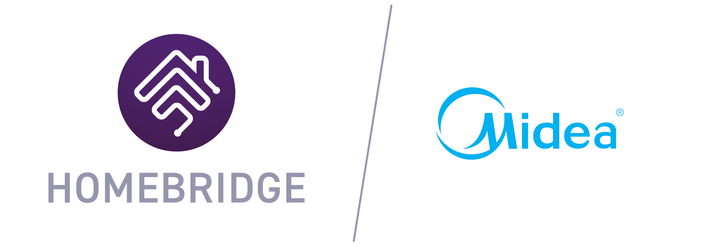

<p align="center">
  <a href="https://github.com/homebridge/verified/blob/master/verified-plugins.json"></a>
</p>

# homebridge-midea-platform

[](https://github.com/homebridge/homebridge/wiki/Verified-Plugins)
[](https://www.npmjs.com/package/homebridge-midea-platform)
[](https://www.npmjs.com/package/homebridge-midea-platform)

_Verified_ plugin for Midea devices. This is implemented by building on the Homebridge platform plugin template and the work done by:

- [@georgezhao2010](https://github.com/georgezhao2010) in the [midea_ac_lan](https://github.com/georgezhao2010/midea_ac_lan) project for Home Assistant
- The [midea-local](https://github.com/midea-lan/midea-local) project.
- [@mill1000](https://github.com/mill1000) in the [midea-msmart (msmart-ng)](https://github.com/mill1000/midea-msmart) project.

More information can be found in the [wiki](https://github.com/kovapatrik/homebridge-midea-platform/wiki).

## IMPORTANT NOTICE

- Fetching the token/key using Midea SmartHome is available again thanks to [cauan](https://github.com/cauan) and [their PR](https://github.com/midea-lan/midea-local/pull/470)
- It's still HIGHLY advised to save the token/key.
- ~~As written by [@wuwentao](https://github.com/wuwentao) in the [midea_ac_lan repository](https://github.com/wuwentao/midea_ac_lan), Midea disabled the token fetching APIs in both Meiju and Midea SmartHome, and now it's only available using the NetHome Plus API.~~
- ~~It's expected that the token fetching in NetHome Plus API will be disabled as well.~~
- ~~Make sure you save your devices' token and key to be able to usem them in the future.~~
- ~~[@wuwentao](https://github.com/wuwentao) also wrote a nice summary about the history of what happened: https://github.com/mill1000/midea-msmart/issues/201#issuecomment-2746782457~~
- ~~For these reasons, only NetHome Plus is enabled in the discovery process.~~

## Features

Currently supports the following devices:

| Device                | ID  | Docs                |
| --------------------- | --- | ------------------- |
| Air Conditioner       | AC  | [link](/docs/ac.md) |
| Dehumidifier          | A1  | [link](/docs/a1.md) |
| Fresh Air Appliance   | CE  | [link](/docs/ce.md) |
| Front Load Washer     | DB  | [link](/docs/db.md) |
| Electric Water Heater | E2  | [link](/docs/e2.md) |
| Gas Water Heater      | E3  | [link](/docs/e3.md) |
| Fan                   | FA  | [link](/docs/fa.md) |
| Humidifier            | FD  | [link](/docs/fd.md) |

### Key Features (Air Conditioners)

- **Comprehensive Mode Control**: Dedicated switches for Cool, Heat, Auto, Dry, Fan, and Self-cleaning modes.
- **Granular Fan Control**: Choose between continuous 0-100% control or specific steps (Low, Med, High, etc.). Full support for native HomeKit/Matter Auto fan mode.
- **Power Management (Gear)**: Limit your AC's power consumption (25%, 50%, 75%, 100% or continuous 0-100% selector).
- **Energy Monitoring**: Real-time power usage (Watts) and total energy consumption (kWh) with Eve Home compatibility.
- **Advanced Comfort**: ION (Anion), iSense (Smart Eye), Eco, Boost, and Sleep modes.
- **Smart Sensors**: Indoor humidity, outdoor temperature, and LED display control.
- **Weather Fallback**: Use local weather data (OpenWeatherMap) as a fallback for indoor humidity if your device's physical sensor is broken.
- **Automation Ready**: Built-in Off Timer (Valve service) to automatically shut down after a set duration. [See recipes](/docs/automations.md).
- **Improved Compatibility**: Optimized for HomeKit (iOS), Google Home (Android), and Matter bridges.

### Unsupported Devices

If you have a device not supported by the plugin then useful information will be logged as warnings. If you are interested in developing support for a device please contact the authors by opening an [issue](https://github.com/kovapatrik/homebridge-midea-platform/issues). Please attach the `lua` file to the issue, if possible. Here is the [guide](/docs/download_lua.md) on how to download the `lua` file.

## Installation

**Option 1: Install via Homebridge Config UI X:**

Search for "midea" in [homebridge-config-ui-x](https://github.com/oznu/homebridge-config-ui-x) and install `homebridge-midea-platform`.

**Option 2: Manually Install:**

```text
sudo npm install -g homebridge-midea-platform
```

 Midea device status is retrieved over your Local Area Network (LAN) and credentials are obtained from the Midea cloud services over the internet. While the plugin maintains a status cache, **use of Homebridge [child bridge](https://github.com/homebridge/homebridge/wiki/Child-Bridges)** is strongly encouraged. As noted below in the _network resiliency_ section, this plugin will make multiple attempts to fulfill a request if necessary, which can take time.

## Matter & Multi-platform Compatibility

This plugin is fully compatible with **Matter**, the unifying standard for smart homes. By exposing your Midea devices via a Matter bridge, you can control them across all major platforms including **Apple Home**, **Google Home**, **Amazon Alexa**, and **Samsung SmartThings**.

### How to set up Matter
1.  **Homebridge 2.0+**: Enable the native Matter bridge in your Homebridge settings.
2.  **Homebridge 1.x**: Use a plugin like `homebridge-matter` or [Matterbridge](https://github.com/Luligu/matterbridge).
3.  **Pairing**: Once enabled, Homebridge will provide a Matter setup code/QR. Pair this code with your preferred platform (e.g., Google Home app).

### Tips for Matter
- **Fan Speed**: For best compatibility with Google Home via Matter, set `fanSpeedMode` to `5 levels` (Silent, Low, Medium, High, Full + Auto) in the AC options.
- **Child Bridge**: Matter works best when the plugin is running in a [Child Bridge](https://github.com/homebridge/homebridge/wiki/Child-Bridges).
- **Dependencies**: If you see "Module not found" errors after an update, run `npm run setup-remote` again to update the dependencies on your server.

## Power & Energy Monitoring

This plugin provides real-time power (Watts) and total energy (kWh) monitoring.

#### For Eve Home App (Recommended)
The plugin automatically exposes standard energy characteristics that are natively visible in the **Eve Home** app. 
- **History**: The plugin supports local data logging (via `fakegato-history`). This allows you to see consumption and climate graphs directly in the Eve app.
- **Auto-Config**: No extra configuration is needed beyond enabling the `Power Meter` option in the device settings.

#### For Homebridge UI (Web Dashboard)
You can see real-time consumption directly in your browser:
1.  Go to the **Accessories** tab in the Homebridge web interface.
2.  Find your Air Conditioner.
3.  Click on the tile to see all details, including **Electric Power (W)** and **Total Consumption (kWh)**.
    *Note: History graphs are NOT displayed in the Homebridge UI accessories tab; they are exclusively for the Eve app.*

#### For Apple Home App (Standard)
Since Apple's Home app does not natively support power meters, the plugin uses a workaround by exposing values via other sensor types. You can configure this in the AC options:

- **Power Display Type**: Choose how to show real-time Watts (e.g., as Lux, Humidity %, CO2 ppm, or Temperature °).
- **Energy Display Type**: Choose how to show total energy kWh (e.g., as a separate Temperature or Humidity sensor).

> [!TIP]
> **To see the number on the dashboard**: 
> - **Lux** and **Temperature** types show the value directly on the tile (e.g., "339 lx" or "339°"). 
> - **CO2** type only shows "Normal" or "Detected" on the tile; you have to click to see the numeric value (ppm).
> - **Humidity** is limited to 100%, so it's not recommended for power display.

> [!IMPORTANT]
> **Graphs in HomeKit**: Apple Home (HomeKit) does **not** natively support history graphs for third-party accessories. You can see the current value in the Home app, but to see historical graphs, you **must** use the **Eve Home** app. HomeKit does not allow "importing" these graphs from Eve.

## Weather Service & Humidity Fallback

If your Midea device has a broken humidity sensor (e.g., it always reports 0% or 255%), you can enable the **Weather Service** to provide local outdoor humidity as a proxy.

1.  **API Key**: Obtain a free API key from [OpenWeatherMap](https://openweathermap.org/api). Note that it can take up to 2 hours for a new key to become active.
2.  **Configuration**: Enable the Weather Service in the global plugin settings and enter your API key.
3.  **Location**: By default, the plugin uses your server's IP address to determine your location. You can also manually specify `latitude,longitude` or a **City Name** in the settings.
4.  **Enable Fallback**: In the specific device settings (AC or Dehumidifier), enable **Humidity Weather Fallback**.

> [!NOTE]
> If humidity still shows **0%** after configuration:
> 1. Check the Homebridge logs for `[WeatherService]` updates.
> 2. Ensure your API key is active (it can take up to 2 hours).
> 3. **Per-Device Activation**: You must enable **Humidity Weather Fallback** in the *specific* settings of your Air Conditioner/Dehumidifier, not just globally.
> 4. **Wait a few minutes**: The plugin will automatically update the display as soon as it receives the first weather data.

## HomeKit Tips & Troubleshooting

### "Accessory Not Certified" Message
If you see a message saying "This accessory has not been certified to work with HomeKit", **this is normal**. Homebridge is an open-source project and is not officially certified by Apple.
- **Does it affect functionality?** No. All features work exactly the same.
- **Can it be removed?** No, as only official commercial hardware gets this certification. You can safely dismiss this warning.
- **Is it the cause of missing sensors?** **No.** If your sensors are missing from the Home tab, it's an interface setting (see below), not a certification issue.

### Accessories Missing from Home View
If some accessories (like Humidity or Power consumption) do not appear on your main "Home" tab, they are likely just hidden or grouped by Apple Home:

1.  **Check the "Climate" Status**: Apple Home often groups sensors (Temperature, Humidity) at the top of the Home tab under a single "Climate" icon. Tap it to see individual values.
2.  **Make them "Favorites"**: To show a sensor as a separate tile on the main screen:
    - Long-press the accessory (e.g., the AC unit) -> **Accessory Details**.
    - Scroll down to the list of services (Humidité, Température).
    - Tap on the specific sensor -> **Accessory Details** (gear icon).
    - Ensure **Add to Favorites** is turned **ON**.
3.  **Check "Show in Home View"**: In the same settings menu, ensure **Show in Home View** is enabled.

> [!IMPORTANT]
> When using a **child bridge**, you must pair the Midea platform separately in your Home app. The accessories will not appear if you only pair the main Homebridge bridge. Look for the QR code specifically for the "Midea Platform" in the Homebridge UI.

## Configuration

### Homebridge Config UI X

[Homebridge Config UI X](https://github.com/oznu/homebridge-config-ui-x) is the easiest and **strongly recommended** way to configure this plugin.

You should use the UI to discover and add devices. More information on the settings can be found in the [wiki](https://github.com/kovapatrik/homebridge-midea-platform/wiki#device-discovery).

### Development & Remote Testing

If you are developing this plugin and want to test it on a remote Homebridge server (e.g., on a Raspberry Pi/Proxmox on your LAN), you can use the built-in deployment scripts:

1.  **Initial Setup**: Run `npm run setup-remote` to prepare your server (installs `rsync`, updates Node.js to v22, and installs dependencies).
2.  **Fast Deploy**: Run `npm run deploy` to build the plugin, sync files to the server, and restart Homebridge automatically.

*Note: Make sure to update the IP address and credentials in `package.json` before running these scripts.*

## Contribution

Help is always welcome. If you'd like to get involved, check out the [contribution notes](CONTRIBUTING.md).

## License

Copyright (c) 2023 [Kovalovszky Patrik](https://github.com/kovapatrik),
Copyright (c) 2023 [David A. Kerr](https://github.com/dkerr64)

Licensed under the Apache License, Version 2.0 (the "License"); you may not use this program except in compliance with the License. You may obtain a copy of the License at [http://www.apache.org/licenses/LICENSE-2.0](http://www.apache.org/licenses/LICENSE-2.0)

Unless required by applicable law or agreed to in writing, software distributed under the License is distributed on an "AS IS" BASIS, WITHOUT WARRANTIES OR CONDITIONS OF ANY KIND, either express or implied. See the License for the specific language governing permissions and limitations under the License.

### Trademarks

Apple and HomeKit are registered trademarks of Apple Inc.

Midea is a trademark of Midea Group Co., Ltd.
